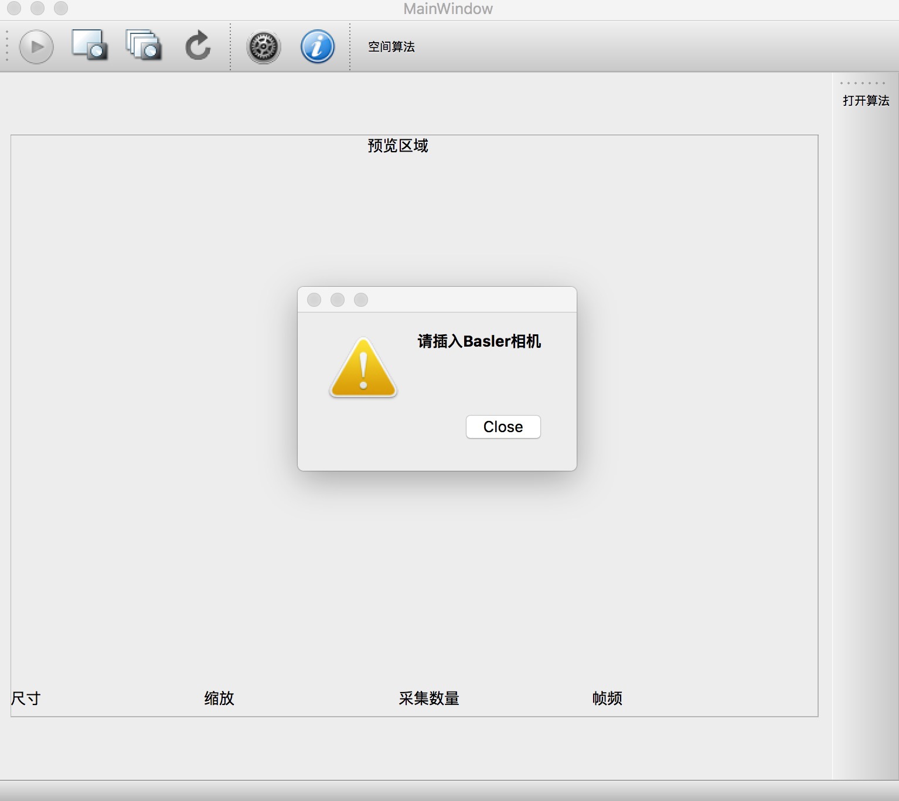
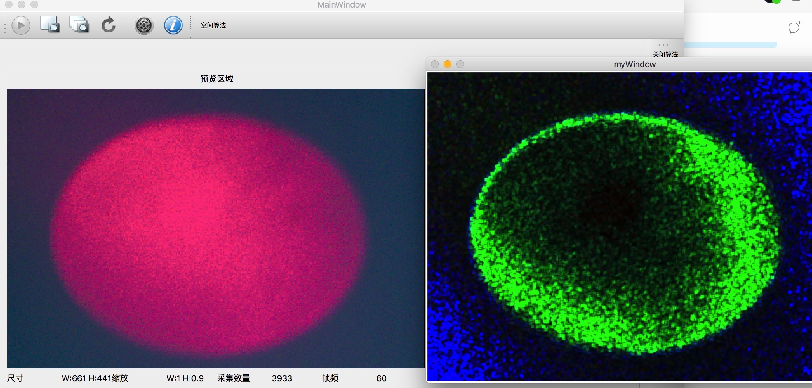
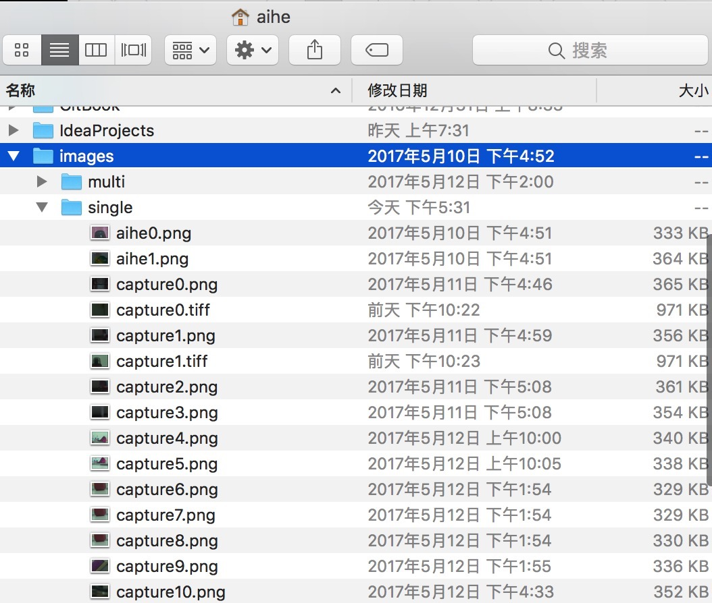

## 在Windows下开发

依赖：
- OpenCV2.4
- PylonSDK 5.05


1. 首先将项目编译为VS项目
```
qmake -spec win32-msvc2013 -tp vc
```

2. 这一步确保你安装了[Pylon SDK](https://www.baslerweb.com/en/products/software/pylon-windows/)打开项目属性，->链接->通用->附加库目录->添加
D:\pylon5\Development\lib\x64


## 在Mac下开发
1、首先安装MacPort
```
sudo port install opencv
```
2、安装Pylon SDK,将Pylon.Framwork库链接到Qt目录下


3、配置Qt系统变量


## 效果图
1、不插入相机



2、插入相机拍摄激光散斑成像


3、插入相机同时进行空间算法处理



4、相机设置界面


5、相机拍摄后保存的结果图



6、多张采集时提示采集进度


## 论文
论文与PPT在paper目录下面


## 在Window上安装相机软件
1、下载dist目录下的MyCamera.exe，[点击这里](dist/MyCamera.exe)

2、去Basler Web上瞎子啊Pylon SDK安装，[点击这里](https://www.baslerweb.com/en/products/software/pylon-windows/)

3、安装之后的位置应该在 C:\Windows\Program Files(x86)\HQU\MyCamera目录下的Mycamera.exe

4、我开发的时候用的是Mac系统，直接运行相机软件会报错。这时候我们需要在目录下面创建一个platforms文件夹，然后拷贝qwindows.dll进去就好。


//TODO，下次打包的时候，把platforms目录放在正确的位置

点击exe文件即可运行，效果类似Mac系统。感兴趣的朋友，可以进行扩充。


